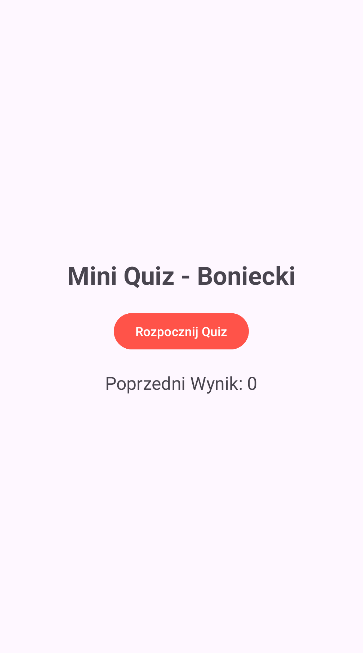
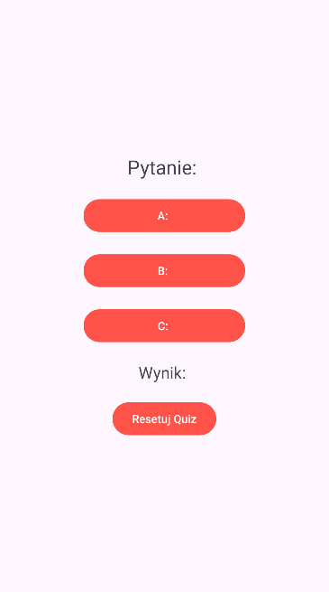

# Mini Quiz - Boniecki

## Opis projektu
Aplikacja mobilna edukacyjna wykonana w Android Studio w języku Java.

Funkcje aplikacji:
- rozpoczęcie quizu
- losowanie 5 pytań z bazy pytań
- wybór odpowiedzi A, B lub C
- naliczanie punktów
- reset quizu
- wyświetlanie końcowego wyniku

Aplikacja składa się z:
- MainActivity
- QActivity
- klasy Question

---

## Instrukcja uruchomienia

1. Pobierz projekt z repozytorium GitHub
2. Otwórz projekt w Android Studio
3. Uruchom emulator lub podłącz telefon
4. Kliknij Run

---

## Zrzuty ekranu aplikacji

### MainActivity

### QActivity

### Wynik końcowy
(tutaj wstaw screenshot końcowego wyniku)
